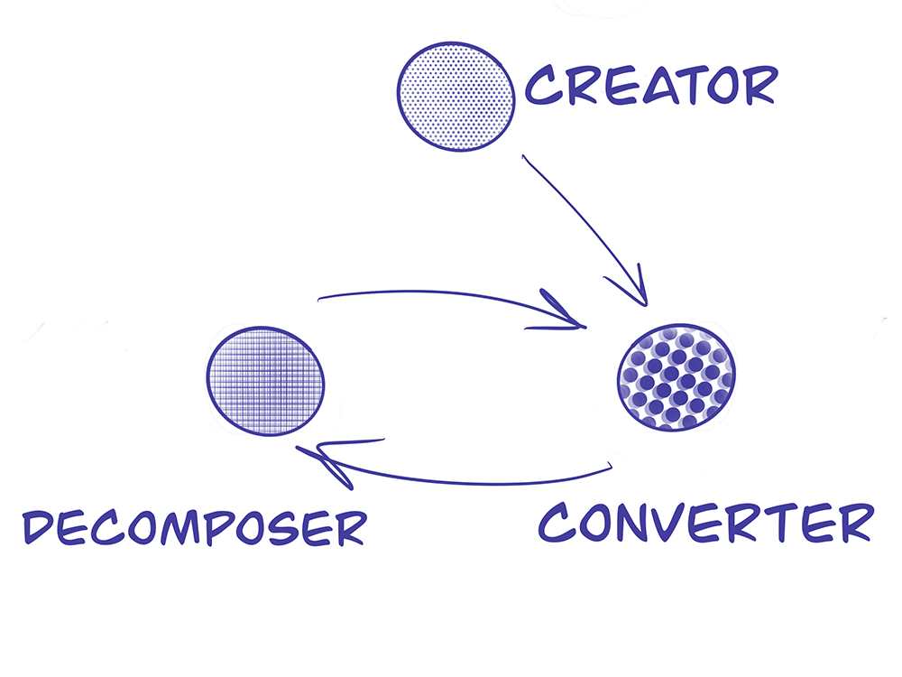

# KryhaAgoricHackathon

## Project description
For this Hackathon, we focused on building a complete Agoric Dapp to solve a circular economy problem. The specific use-case that we are tackling revolves around the manufacturing and recycling of plastic bottles.

One of the current problems in circular value chains is a lack of reliable information about the products and their life cycles. This lack of information makes it difficult for recyclers to know what kind of plastic bottles are produced and which ones are recyclable. Unfortunately, these circular model inefficiencies lead to an increase in the overall cost, making the model less viable than the linear model. 

Our solution solves this problem by providing all value chain stakeholders with a shared source of truth for the tracking of the plastic product lifecycles. This single source of truth enables the recyclers to know exactly which products are recyclable, increasing the overall efficiency in the circular economy.

Our demo includes three stakeholders namely a creator, a converter and a decomposer.



Creator: able to create new plastic raw materials that can be used by a converter.

Converter: able to purchase plastic raw materials from the creator and convert them into plastic bottles.

Decomposer: able to purchase waste plastic bottles from the converter and decompose them into raw materials.

## Limitations
- At the start of the project we encountered several issues when working with multiple wallets. We modified the project to work without multiple wallets by including an invoice system that simulates payments without actually exchanging any tokens or assets. This caused the workflow to make less sense and therefore, we included a message within the application that explains when a transaction should have occurred.

---

## Development

### Install the agoric SDK
Follow the instructions from:  
https://agoric.com/documentation/getting-started/before-using-agoric.html

### Clone the repo
```git clone https://github.com/Kryha/KryhaAgoricHackathon.git```

### Go to directory
```cd KryhaAgoricHackathon```

### Install Javascript dependencies
```agoric install```

### Start the Agoric VM 
```agoric start --reset```

### Deploy Dapp, install smart contracts and web apis
```agoric deploy ./contract/deploy.js ./api/deploy.js```

### Start the Frontend
```cd ui```
```yarn install```
```yarn start```

Visit ```http://localhost:3000``` for the frontend and ```http://localhost:8000/``` for the wallet.

### Important todo after any code change
While developing follow the guide for every change you make
https://agoric.com/documentation/getting-started/development-cycle.html

---

## Smart Contracts
- ```tokenCreation```: Mints fungible tokens, for the Creator. Mirroring the initial raw (virgin) materials being sourced in the physical world.
- ```converter```: The converter contract creates a new non-fungible token in exchange for burning (destructive usage of) a predefined number of fungible tokens. This contract converts input A into output B, losing A in the process. This contract mirrors a destructive manufacturing process. As an example we use a process in which raw materials are used to make an empty plastic bottle. The tokens representing the raw materials are used in the process of creating the badge for the newly minted empty plastic bottle.
- ```decomposer```: Opposite of the converter contract. This contract recycles the materials created by the converter contract. It takes an NFT and converts it into its source materials. In our example an empty plastic bottle is decomposed into new tokens representing the recycled representation of the source materials. Another option would have been to combine the converter and decomposer contract by holding the inputs in the contract until they are needed for a decomposition, if both the conversion and decomposition processes are perfect, this would be possible but we assume that this is not the case and therefore have chosen to split them up. An improvement would be to create one convert contract that is able to convert NFTs to Fungible tokens and vice versa and to take any amount of tokens/assets as input and output.
- ```plasticA```: Mints a non-fungible token which represents a plastic of type A and sets the attributes of the plastic.
- ```invoiceCreation```: Mints a non-fungible token which represents an invoice and sets the attributes of the invoice.

## Improvements
- Use multiple wallets: This way the demo can be closer to real use case scenarios and also more descentralized. All identities will have a need to know basis, and their own purses. This will also make it possible to trace plastics to individual parties and trace the recycle history of individual products. For example; we can trace how much of a specific bottle has been made of recycled plastics.
- More checks need to done in the smart contract level in order to utilize Zoe's security.
- Tests have to be written to validate the correct behaviour of the smart contracts.
